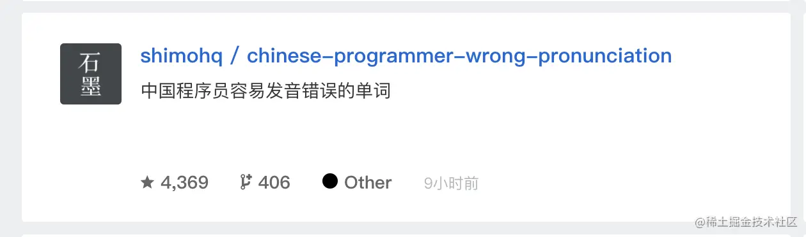

# css 规范

css 规范文档

## 命名

  - 样式类名使用小写字母，以半角连接符(-)分割；
  
  - id 采用驼峰式命名；
  
  - scss / less 中的变量、函数、混合、placeholder 采用驼峰式命名  

#### 不推荐：
      .fw-800 {
        font-weight: 800;
      }
      .red {
        color: red; 
      }

#### 推荐:
      .heavy {
        font-weight: 800;
      }
      .important { 
        color: red; 
      }

## 选择器
  - css 选择器中避免使用标签名
    
    > 从结构，表现，行为分离的原则来看，应改尽量避免css 中出现HTML 标签，并且在css 选择器种出现标签名会存在潜在的问题。

  - 使用直接子选择器

    > 很多前端开发人员写选择器链的时候不使用直接子选择器（注：直接子选择器和后代选择器的区别）。有时，这可能会导致疼痛的设计问题并且有时候会很消耗性能。然而，在任何情况下，这是一个非常不好的做法。如果米不屑很通用的，需要匹配到DOM 末端的选择器，你应该总是考虑直接子选择器。

#### 不推荐：
      .content .title {
        font-size: 2rem;
      }

#### 推荐:
     .content > .title {
        font-size: 2rem;
      }

## 尽量使用缩写属性

#### 不推荐：
      border-top-style: none; 
      font-family: palatino, georgia, serif; 
      font-size: 100%; line-height: 1.6; 
      padding-bottom: 2em; 
      padding-left: 1em;
      padding-right: 1em; 
      padding-top: 0;

#### 推荐:
      border-top: 0; 
      font: 100%/1.6 palatino, georgia, serif; 
      padding: 0 1em 2em;
       
  
### 省略 0 后面的单位

#### 不推荐：
      div {
        padding-bottom: 0px; 
        margin: 0em;
      }

#### 推荐:
      div {
        padding-bottom: 0; 
        margin: 0; 
      }

## 避免使用 ID 选择器及全局标签选择器防止污染全局样式

#### 不推荐：
      #header {
        padding-bottom: 0px; 
        margin: 0em;
      }

#### 推荐:
      .header { 
        padding-bottom: 0px; 
        margin: 0em; 
      }

## 墙裂推荐 [BEM](https://getbem.com/) 命名

### 为什么需要BEM

  如果编写项目的 CSS 代码只有你一个人，或者项目的 CSS 代码量很小，你可以用你喜欢，习惯的方式去组织你的 CSS 代码。但是项目更大，更复杂，有多人编写项目的 CSS 代码（每个人有自己的风格），代码量大的时候，就需要一种统一形式去组织 CSS 代码，这时候 BEM 就派上用场了。

### 什么是BEM

  BEM(Block Element Modifier) 是一种命名CSS class的模式，使用这种模式可以让 CSS 代码更加利于维护。标准的 BEM 写法是 .block-name__element-name--modifier-name。

### Block

> 页面上逻辑和功能独立的，可复用的组件，可以嵌套并相互交互，但在语义上它们保持平等，可以存在页面上不同的位置或不同项目中，保持样式不变。

  可以使用字母，数字，连字符进行命名，任何html元素都可以成为一个block，不依赖于页面上的其他block或者element。

      <header class="header"></header>

      .header {
        color: #333;
        background: #f5f5f5;
      }

### Element

> 组成块的一部分，内部的任何元素都与块有关联，不能在块的外部使用。

        <article class="article">
          <h2 class="article__title"></h2>
          

        </article>

        .article {
          padding: 12px;
        }

        .article__title {
          font-size: 1rem;
        }

        .article__content {
          font-size: .9rem;
        }

### Modifier

> 用来表示块或者元素的状态，外观或者行为，不必须，可以选择使用。

        <button class="btn btn--disabled"></button>

        .btn {
          color:  #333;
          background-color: #fff;
        }

        .btn--disabled {
          color: #fff;
          background-color: #6c757d;
        }

### 示例

这样的卡片是一个单独的块

      

        
        

          
          

          

            <i class="list-card__icon"></i>
            <i class="list-card__icon"></i>
            <i class="list-card__icon"></i>
            
          

        

      

### 常用CSS class名

  #### 包裹类

          container,  wrapper,    outer,    inner,    box,
          header,     footer,     main,     content,  aside,
          page,       section,    block

  #### 状态类

          primary,    secondary,  success,  danger,   warning,
          info,       error,      Link,     light,    dark,
          disabled,   active,     checked,  loading

  #### 尺寸类

          large,      middle,     small,    bigger,    smaller

  #### 组件类

          card,       list,       picture,  carousel,   swiper,
          menu,       navs,       badge,    hint,       modal,
          dialog

  #### 位置类

          first,      last,       current,  prev,       next,
          forward,    back

  #### 文本类

          title,      desc,       content,  date,        author,
          category，  label，      tag

  #### 人物类

          avatar,     name,       age,      post,         intro

### 推荐学习 [scss](https://www.sasscss.com/documentation)